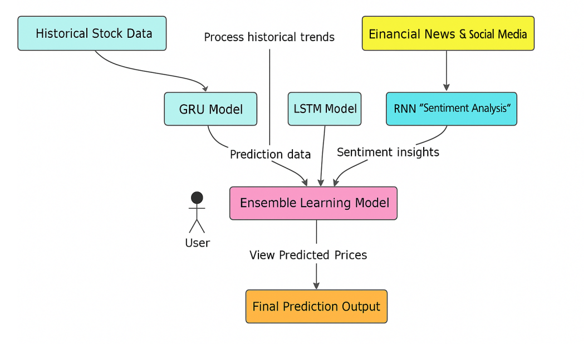
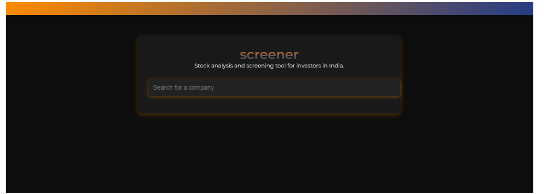
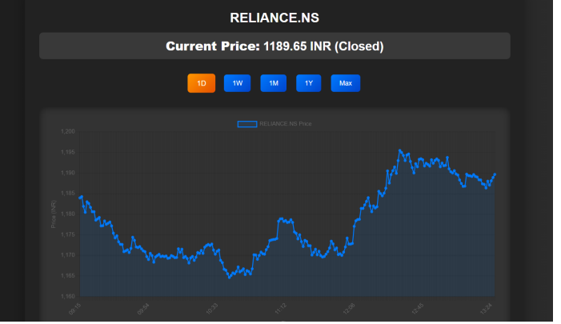

# Sentiment-Infused Stock Price Prediction

A robust hybrid model to predict the next day’s closing price range for individual stocks using a deep learning ensemble approach.

🔹 Key Highlights:

Model Architecture: Integrated LSTM and GRU models in an ensemble framework to enhance forecast accuracy and generalization.

Stock-specific Models: Trained separate models for each stock using the past 4 years of historical data to capture individual market behavior patterns.

Time-Series Strategy: Used a 60-day price window as input to forecast the next day's closing price range.

Sentiment Integration: Incorporated news sentiment analysis to account for real-time market sentiment and improve prediction reliability.

Ensemble Output: Combined predictions from LSTM, GRU, and a meta-model to generate a more stable and accurate forecast.

🔧 Tech Stack: Python, TensorFlow/Keras, Scikit-learn, NLTK/VADER, Pandas, NumPy, Matplotlib, yFinance API







## Project Structure

```
stock-market-analysis
├── stock_market_analysis
│   ├── __init__.py
│   ├── settings.py
│   ├── urls.py
│   ├── wsgi.py
│   └── asgi.py
├── manage.py
└── README.md
```

## Installation

1. Clone the repository:
   ```
   git clone <repository-url>
   ```
2. Navigate to the project directory:
   ```
   cd stock-market-analysis
   ```
3. Create a virtual environment:
   ```
   python -m venv venv
   ```
4. Activate the virtual environment:
   - On Windows:
     ```
     venv\Scripts\activate
     ```
   - On macOS/Linux:
     ```
     source venv/bin/activate
     ```
5. Install the required packages:
   ```
   pip install -r requirements.txt
   ```

## Usage

1. Run the development server:
   ```
   python manage.py runserver
   ```
2. Access the application at `http://127.0.0.1:8000/`.

## Contributing

Contributions are welcome! Please open an issue or submit a pull request for any improvements or features.
